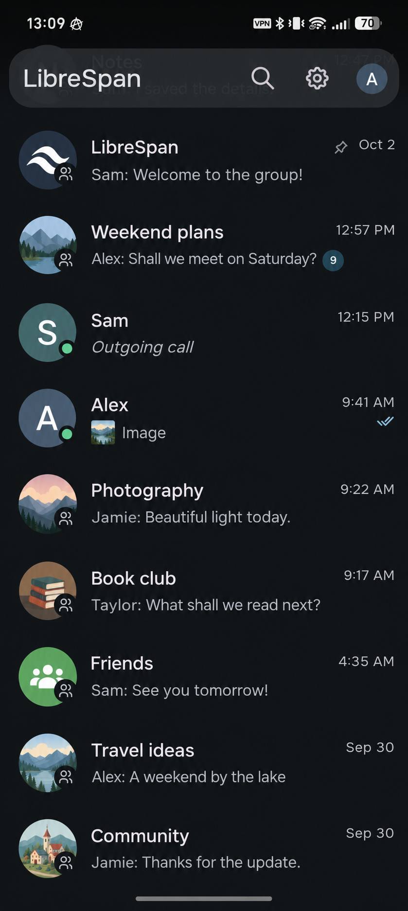
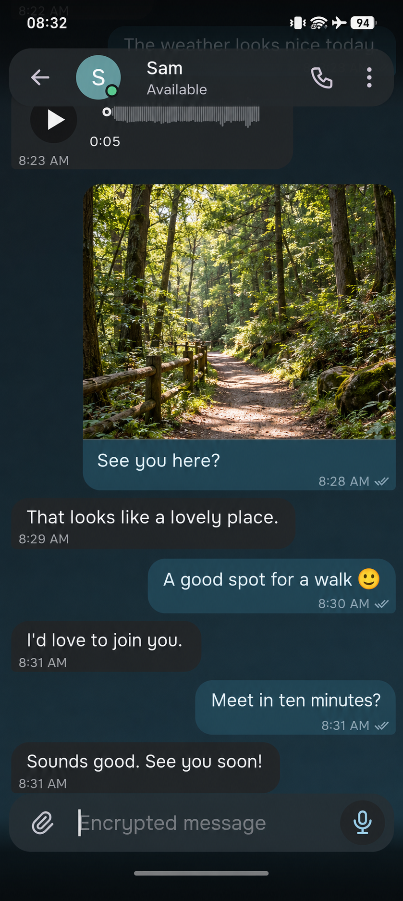
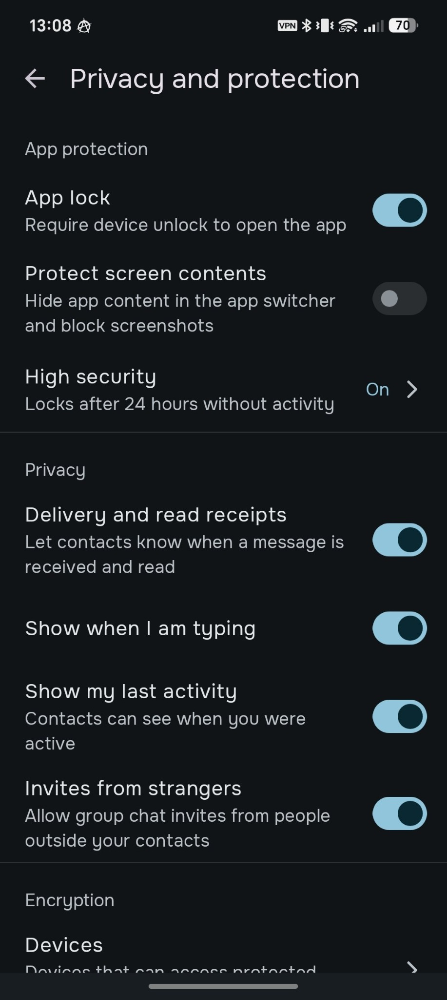

# LibreSpan

**LibreSpan** is a modern Android XMPP messenger derived from **Conversations** through
**AnotherIM**. It keeps the mature XMPP foundation while simplifying the UX and strengthening local
data protection.

The public build is **provider-independent**: it does not require or default to a specific XMPP
server. Users sign in with a full JID (`user@example.org`), and server capabilities are discovered
through XMPP.

## Highlights

- XMPP with OMEMO end-to-end encryption
- provider-independent account setup
- simplified chat, settings and account-management UX
- Secure Content Store for protected local message and media storage
- protected text/media paths with secure local search
- app lock and High Security key/recovery protection
- file, image, audio, voice and video messaging
- MAM, HTTP Upload and UnifiedPush support
- Jingle/WebRTC audio and video calls
- Stream Management and reconnect handling for mobile network changes
- XEP-0401 account-creation invites when supported by the server

## Screenshots

<p align="center">
  
  
  
</p>

## Build

LibreSpan ships one universal APK per selected build type. ABI-specific split APKs are disabled.

```text
./gradlew assembleLibreSpanDebug
./gradlew assembleLibreSpanRelease
```

Build outputs are written under `build/outputs/apk/conversationsFree/`. The internal Android
variant remains `ConversationsFree`; the LibreSpan Gradle aliases are the supported human-facing
build commands.

## Channel lifecycle

For a root MUC/channel:

- **Clear history** removes local message/media history without leaving the room.
- **Leave channel / group chat** leaves the MUC, keeps local history available read-only, keeps the
  bookmark with autojoin disabled, and requires an explicit **Return/Join** action to participate
  again.
- **Delete channel / group chat from device** leaves the MUC and removes the local conversation,
  local history/media and bookmark. A local suppression marker prevents background sync, reconnect
  traffic or invitations from silently recreating it; a later explicit Join is still allowed.

## Security

See [Security Policy](SECURITY.md) for LibreSpan's release-level security model, supported-version
policy, vulnerability-reporting guidance, OMEMO boundaries, protected local storage and High
Security behavior.

## Provider independence

LibreSpan does not hard-code an account domain or registration provider. Standard `xmpp:` URIs
are used for sharing accounts and fingerprints. Account registration is available when the selected
XMPP server supports it. Optional services such as UnifiedPush are not preconfigured to a
project-owned server.

## Upstream and provenance

The source lineage is:

```text
Conversations — Daniel Gultsch (iNPUTmice)
    ↓
Narayana fork line / Conversations Classic / AnotherIM
    ↓
LibreSpan
```

[Daniel Gultsch (iNPUTmice)](https://codeberg.org/iNPUTmice) is the original developer and principal
upstream maintainer of Conversations. The direct source baseline used for LibreSpan came through the
Narayana fork line, including Conversations Classic / AnotherIM.

Historical AnotherIM/Narayana identifiers may remain in compatibility code as provenance traces,
not current branding. Detailed source-lineage and file-level licensing rules are documented in
[Provenance and Licensing](docs/legal/PROVENANCE_AND_LICENSING.md).

## Support LibreSpan

If LibreSpan is useful to you and you'd like to support its development, you can send a donation in Monero (XMR):

```text
83uevENGJ7fKExiAgV8BeB4fzEGDgNmcm989GGaSaFzUcMUrUuYxhSzPmrhMwjXiqSQqBcWkWzz8cH3C1bN58enABYzeXBJ
```

Support is entirely optional.

## License

The LibreSpan Android application remains distributed under the **GNU General Public License v3**.
See [LICENSE](LICENSE).

Upstream copyright notices and GPL obligations must be preserved. Release attribution and bundled
third-party/data notices are summarized in [NOTICE](NOTICE).

Some independently authored LibreSpan security/storage files carry their own
`SPDX-License-Identifier: MPL-2.0` and provenance markers such as `NATIVE-CORE` or
`NATIVE-ANDROID`. These file-level licenses do not relicense inherited GPL code or remove the GPL
obligations that apply to distribution of the application as a whole. See
[Provenance and Licensing](docs/legal/PROVENANCE_AND_LICENSING.md) for the current audit status.
